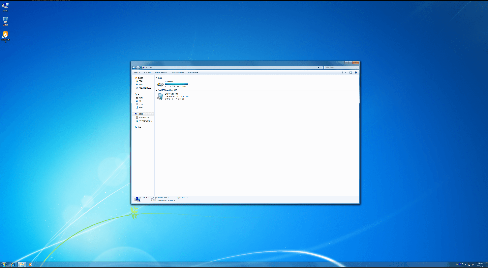

Windows 7 的默认设置并不十分适合操作触屏设备。本文旨在通过一些对设置的更改，使其更适合触屏设备使用。

# 调整 UI 缩放比例
电子白板的屏幕尺寸较大，因此即使分辨率仅为 1920×1080，依然会出现字体和 UI 控件太小导致难以通过触摸的方式控制的问题：

因此，我们需要调整 Windows 7 的 UI 缩放比例，以放大字体和 UI 控件。

首先，依此点击开始菜单>控制面板>外观和个性化>放大或缩小文本和其他项目，打开显示缩放设置；

在显示缩放设置界面中，将比例设置为“较大 - 150%”，点按“应用”>“立即注销”；

!!!note
    使用 Windows 10 操作系统时，通常会使用 200% 的缩放比例。但在 Windows 7 被广泛使用的年代，高分辨率显示器尚未普及，UI 缩放功能通常被当作“辅助功能”，专门提供给弱视患者。需求的缺乏，导致 Windows 7 在大于 150% 的缩放比例下存在 UI 映射不准的问题，可能会导致触摸无法正常使用。

Windows 将注销（**此过程会强制退出所有正在运行的用户态程序，请注意保存重要数据**），在登录画面中点击头像，再次登录后即可看到 UI 缩放比例已经更新。

# 调整 Windows 资源管理器的“文件夹视图”设置
Windows 默认的“列表”视图非常不适合在触摸设备上使用，因为十分容易误触。

我们建议将其改为“内容”以方便操作。

首先，随意打开一个资源管理器窗口，点击左上角的“更改视图”按钮，选择“内容”；

接下来，按下 <kbd>Alt</kbd> 键（可以使用物理键盘或 Tablet PC 输入面板。在使用后者时，请注意需要触摸两次 <kbd>Alt</kbd> 按钮以解除该键的锁定状态），此时 Windows 资源管理器会显示其工具栏，依此点击“工具”>“文件夹选项”打开“文件夹选项”设置；

在该设置面板中，切换到“查看”选项卡，点击“应用到文件夹”>“是”，即可将此视图应用到大多数文件窗口中。

!!!note
    部分特殊文件夹（如含有大量媒体的文件夹）会有不同的视图。对于此类文件夹通常无需特别关心。

