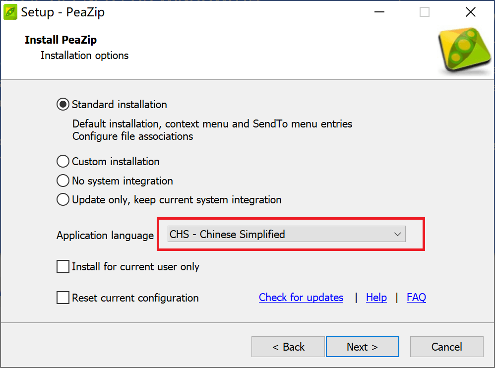

!!!warning
	此类软件是流氓软件的重灾区。请务必仔细选择，以防电脑感染流氓软件。以下点名几个臭名昭著的软件：2345好压、快压。

!!!note
	考虑到 Bandizip 6 可能存在的安全问题，我们将其推荐优先级降低了。

## PeaZip
此软件兼具下文提到的 7zip 和 Bandizip 两个软件的优点——开源免费，设计优良。

您可以在这里下载到此软件：<https://peazip.github.io/peazip-64bit.html>{: target="_blank" rel="noopener noreferrer" .external }

安装过程中请自行将语言设置为"CHS - Chinese Simplified"（简体中文）

{: style="width: 50%" }

## 7zip
这个软件胜在开源、体积小巧、跨平台（最近终于支持 Linux 了，可喜可贺可喜可贺）。

但外观……怎么说呢？十分的复古。

您可以在这里下载到此软件：<https://www.7-zip.org/download.html>{: target="_blank" rel="noopener noreferrer" .external }

~~看不懂下载网页的话，你自个找你英语老师谢罪罢~~

## Bandizip 6
界面美观，可配置性强，功能强大。基本上是个归档格式都能用这个软件打开。

可以自定义代码页，对于解决一些打开于使用 *非 GBK/UTF-8 兼容* 编码（如日文 Windows 使用的 Shift-JIS 编码）的系统上创建的压缩文件出现文件名或文件内容乱码的情况很有帮助。

您可以在这里下载到此软件：<https://www.bandisoft.com/bandizip/old/6/>{: target="_blank" rel="noopener noreferrer" .external }

!!!important
	此软件的开发商 Bandisoft 近期宣布在 Bandizip 6 中发现了一个安全漏洞，并建议用户尽快升级至 Bandizip 7[^1]。考虑到 Bandizip 7 是付费软件，且官方未给出此“漏洞”的任何详细信息，请自行斟酌是否继续使用。

!!!note
	Bandizip 7 及后续版本开始添加广告，必须付费购买许可证才能去除。故此处给出的下载链接是官方保留的，最后一个无广告版本的下载地址。安装完后请务必按照如下步骤关闭自动更新功能。  
	{: style="width: 50%" }  
	{: style="width: 50%" }

[^1]: <https://www.bandisoft.com/bandizip/old/6/>{: target="_blank" rel="noopener noreferrer" .external }