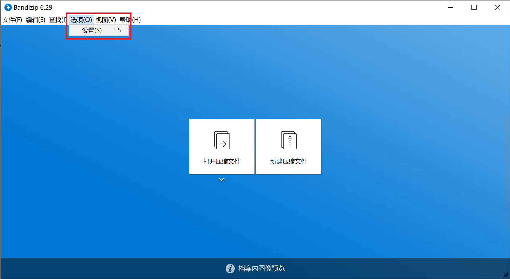

!!!warning
	此类软件是流氓软件的重灾区。请务必仔细选择，以防电脑感染流氓软件。以下点名几个臭名昭著的软件：2345好压、快压。

# Bandizip 6
界面美观，可配置性强，功能强大。基本上是个归档格式都能用这个软件打开。

可以自定义代码页，对于解决一些打开在使用 *非 GBK/UTF-8 兼容* 编码的系统（如日文 Windows 使用的 Shift-JIS 编码）上创建的压缩文件出现文件名或文件内容乱码的情况很有帮助。

您可以在这里下载到此软件：[https://www.bandisoft.com/bandizip/old/6/](https://www.bandisoft.com/bandizip/old/6/)

!!!important
	Bandizip 7 及后续版本开始添加广告，必须付费购买许可证才能去除。故此处给出的下载链接是官方保留的，最后一个无广告版本的下载地址。安装完后请务必按照如下步骤关闭自动更新功能。
	
	

# 7zip
<del>其实我知道再推荐一个你们也不会看的</del>

<del>压缩软件管理器对大多数人而言就那么几个功能，推荐这么多真没意思</del>

这个软件胜在开源，体积小巧、跨平台（最近终于支持 Linux 了，可喜可贺可喜可贺）。

但外观……怎么说呢？十分的复古。

您可以在这里下载到此软件：[https://www.7-zip.org/download.html](https://www.7-zip.org/download.html)

<del>看不懂下载网页的话，你自个找你英语老师谢罪罢</del>