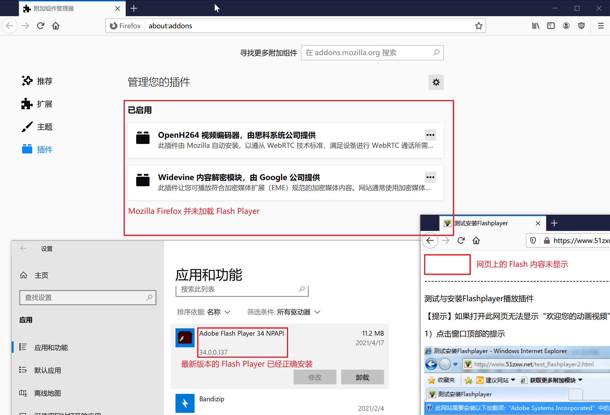
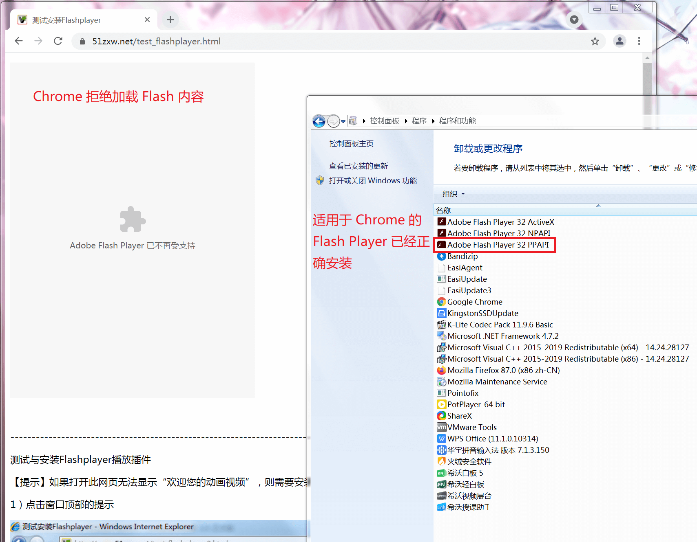
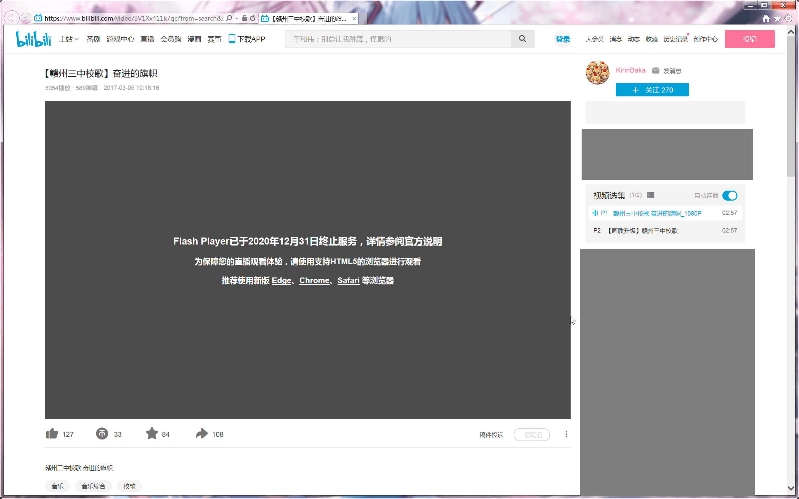

!!! warning
	Adobe Flash Player 已经完成了它的使命，于2021年1月12日正式向世界宣告死亡。作为一个已经停止更新的软件，它具有严重的安全和性能问题。除非迫不得已，不建议任何人在其个人电脑上安装任何版本的 Adobe Flash Player。但考虑到目前数学、物理、地理等科目教师仍有在 PPT 内嵌入 Flash 交互式内容的需求，我们依然编写了此章节。

<!-- 众所周知，中国大陆并不属于肮脏的、资本主义当道的世界。 -->
Flash Player 本身并没有广告，但自从 2018 年 2 月 28 日，Adobe 将其中国大陆地区运营权授予重庆重橙网络科技有限公司后，该公司开始在“中国大陆特供版”Flash Player 中植入恶意软件 FlashHelperService，进行窃取用户隐私以及投放低俗广告等流氓行为[^1]；且停止该服务会导致 Flash Player 停止运行。

目前“中国大陆特供版”Flash Player 依然在“积极更新”中。

**我们强烈反对安装此版本的 Flash Player。** 作为替代，我们建议安装网民发布的修改版 Flash Player。以下介绍详细的流程：

## 清除“中国大陆特供版”Flash Player
1. 前往 <https://geekuninstaller.com/download>{: target="_blank" rel="noopener noreferrer" .external } 下载 Geek Uninstaller。（这是一个免费的软件卸载辅助工具，可以清理软件卸载后的残留文件。）下载完毕后打开，在软件中找到第一个带有“Adobe Flash Player”字样的软件条目，双击它，将其卸载。卸载流程结束后，此软件会自动分析残留文件并显示出来，点按删除按钮（请勿自作聪明一次性卸载所有 Flash Player 软件）；
2. 重新启动一体机，以确保所有组件已经成功完成反注册。这一步非常重要；
3. 重复 1、2 步骤直到所有 Flash Player 软件都被卸载。

## 安装修改版 ActiveX 版 Flash Player
1. 点击 [这里](#) 下载修改版的 Flash Player，按照常规安装方式安装；
2. 使用 Internet Explorer 浏览器打开 <https://www.51zxw.net/test_flashplayer.html>{: target="_blank" rel="noopener noreferrer" .external }，确保能看到欢迎文字；这代表适用于 ActiveX 的 Flash Player 安装完成。

此时 Google Chrome（仅 Chrome 89 及以上版本，需要 PPAPI Flash）、Mozilla Firefox（需要 NPAPI Flash）等浏览器依然无法播放 Flash 内容。但目前 CCTV、哔哩哔哩弹幕视频网、腾讯视频等常用视频网站的播放器均已改用 HTML5 技术构建，故已无安装适用于这些浏览器的 Flash Player 之必要。

!!!note
	实际上，Google Chrome[^2] 以及 Mozilla Firefox[^3] 已经停止了对 Flash Player 的支持；现在，它们不会加载 Flash Player ，从而不会播放任何 Flash 内容。哔哩哔哩弹幕视频网也停止了对 Flash Player 的支持，不支持 HTML 5 的浏览器（如 Internet Explorer）将无法播放视频。  
	{: style="width: 50%" }  
	{: style="width: 50%" }  
	{: style="width: 50%" }

关于娱乐网站上的 Flash 内容问题，我们请您注意：**在电子白板上进行与教学无关的活动是被明令禁止的**，请规范自己的行为。

[^1]: <https://www.ithome.com/html/it/369981.htm>{: target="_blank" rel="noopener noreferrer" .external }
[^2]: <https://support.google.com/chrome/a/answer/10706877>{: target="_blank" rel="noopener noreferrer" .external }
[^3]: <https://support.mozilla.org/en-US/kb/end-support-adobe-flash>{: target="_blank" rel="noopener noreferrer" .external }