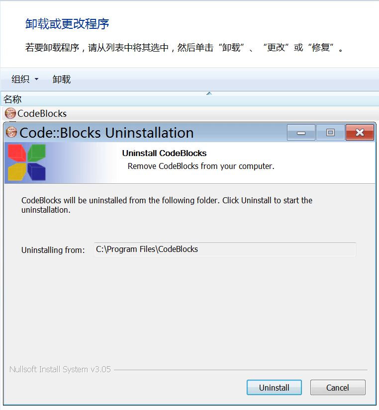

# 前言
由于种种原因，中国大陆仍然存在许多靠开发推送垃圾广告的软件营利的互联网企业，比如**上海二三四五网络控股集团股份有限公司**。这些公司所发布的软件通常有以下特征：

- **涵盖面广，且具有一定实用性**：以前文提到的**上海二三四五网络控股集团股份有限公司**为例，其开发的软件涵盖*浏览器*，*输入法*，*杀毒软件*，*文档阅读器*，*图片查看器*，*压缩文件管理器*，*视频播放器*，*游戏集合*八大分类，完整、全面地涵盖了普通网络用户的所有软件需求，且这些软件都使用极为成熟的技术所构建，能够正常、稳定地使用。

- **诱导安装**：这些公司所开发的软件一旦安装上其中一款，就会抓住一切机会向用户推广该公司所开发的其他产品，最终的结果就是用户计算机上的软件被该公司开发的软件全面接管。

- **难以卸载**：这类软件的卸载程序在执行卸载操作时，常常在计算机操作系统内保留部分自身组件（如广告组件），以达到继续利用用户计算机营利、或是诱导用户重新安装的目的。部分恶意软件甚至会对计算机操作系统进行一定程度的破坏，使用户误认为计算机出现异常是卸载了这类软件的原因，从而诱使用户重新安装软件。

此类软件对学校的教育教学、普通用户的日常使用造成了巨大困扰，许多用户不堪其扰、甚至选择放弃使用 Windows 操作系统。本章节旨在尽可全面地讲述如何从计算机操作系统中清除此类软件，并防止此类软件再次被安装到操作系统中。

# 关闭 WPS Office 的广告

此软件所带的广告能以简单的方式移除。以下介绍方法。

1. 打开开始菜单，在 "WPS Office" > "WPS Office 工具" 文件夹中找到“配置工具”并打开。在弹出的窗口中点按“高级...”；  

2. 切换到“其他选项”选项卡，勾选“关闭WPS热点”和“关闭广告弹窗推送”选项卡，点按“确定”，关闭配置工具。  

# 为浏览器安装去广告扩展程序

浏览器中的网页广告同样不容忽视，此类广告有时比桌面弹窗广告更具破坏性，严重时甚至可能卡死整个系统。以下以 Mozilla Firefox 浏览器为例，介绍通过安装去广告扩展程序去除网页广告的方法。

1. 打开 Mozilla Firefox，访问 <https://addons.mozilla.org/zh-CN/firefox/addon/ublock-origin/>{: target="_blank" rel="noopener noreferrer" .external }，点按网页中的“添加到 Firefox”，即可安装 uBlock Origin 扩展程序。  

对于其他浏览器（如 Google Chrome 浏览器），也可进入浏览器官方提供的扩展程序下载网站，搜索此扩展程序并添加。添加完成后，通常无需附加设置即可开始使用。

# 清理桌面弹窗广告

## 移除显而易见的广告软件

!!!note
    建议卸载所有的 2345 系软件、360 系软件以及除 WPS 以外的金山系软件。
    对于所有以 `Microsoft` 开头的软件，请不要随意卸载；这些软件通常是某些软件正常运行所必须的。

1. 前往 <https://geekuninstaller.com/download> 下载 Geek Uninstaller。（这是一个免费的软件卸载辅助工具，可以清理软件卸载后的残留文件。），卸载所有不认识的软件；

2. 按下 <kbd>Win</kbd> + <kbd>R</kbd> 键，输入 `%temp%`，按下回车，并删除此目录下的所有内容；再次按下 <kbd>Win</kbd> + <kbd>R</kbd> 键，输入 `%systemroot%/Temp`，按下回车，并删除此目录下的所有内容，对于提升“占用中”的内容，选择跳过即可。这两个目录分别存储用户和操作系统的临时文件，删除其中的文件不会对操作系统的运行造成任何影响；

3. 重启计算机，再次执行步骤 2 中的操作。

以上步骤能够清除大部分因流氓软件带来的广告弹窗，如果还是出现广告，请继续阅读：

## 手动寻找广告软件

!!!note
    下文将使用笔者自行制作，使用 CodeBlocks IDE 编辑及其内置编译器编译的一个弹窗程序进行演示。此软件本身不是恶意软件。

前文所述的步骤可以移除大多数广告软件，但也有部分软件对自身的伪装较好，导致无法通过上述步骤卸载。此时请遵循以下步骤。

1. 访问 <https://docs.microsoft.com/en-us/sysinternals/downloads/process-explorer>{: target="_blank" rel="noopener noreferrer" .external }，点按 "Run now from Sysinternals Live." 的蓝色超链接，下载 Process Monitor 软件；  

2. 重启计算机，等待广告弹窗出现；  

3. 当广告弹窗出现时，右键单击/长按软件图标，选择“以管理员身份运行”，打开 Process Monitor（首次运行此软件会要求阅读一份许可协议，阅读完毕后点按 "Agree" 即可），将工具栏的十字准星按钮拖动到广告窗口上；  

4. Process Explorer 将会高亮显示此弹窗对应的程序条目，右键单击/长按此条目，点按 "Properties..." 选项，在弹出的属性窗口中即可看到创建此弹窗的程序之路径。点按右侧的 "Explore" 打开此路径，按照上文所述步骤卸载对应此路径的软件即可。  

### 如果此广告程序路径不属于任何软件

在寻找到弹窗程序路径后，通常的做法是直接将对应此路径的软件彻底卸载。但也有可能遇到此情况：路径位于操作系统的临时目录，即使删除此程序，依然会被重新创建。

此时我们需要使用 Process Monitor 软件监控进程行为，以便定位创建广告程序的软件。

1. 访问 <https://docs.microsoft.com/en-us/sysinternals/downloads/procmon>{: target="_blank" rel="noopener noreferrer" .external }，使用和前文相同的方法下载 Process Monitor 软件；

2. 打开此软件（此软件会自动请求管理员权限），点按工具栏上的 "Filter" > "Filter..." 打开事件筛选器；  

3. 在打开的事件筛选器窗口中，将第一个列表框设置为 "Path"，第二个设置为 "is"；在右侧的文本框中粘贴前文步骤中发现弹窗程序的路径。填写完毕后点按 "Add" 添加筛选器；  
  
为了排除干扰，我们将 “Windows 资源管理器” 以及 “Windows 索引服务” 的进程从列表中排除，同时仅监视文件创建操作。按照下图设置即可。每填写一个都需要点按 "Add" 添加筛选器。  
  
  
  
操作完毕后点击 "OK" 关闭此窗口；

4. 删除前文步骤中发现的弹窗程序，等待此文件被再次生成。当此文件被生成时，此软件将立刻显示。（通常也可以忽略由 svchost.exe 进行的文件创建操作）右键点击/长按程序条目，点按 "Properties..." 打开属性窗口，在 "Path" 处可看到执行创建操作的软件路径。卸载此路径对应的软件即可。  
  
  
!!!note
    上图仅为演示，实际操作时请使用 *Geek Uninstaller* 而非*控制面板*，以防残留。
    卸载完广告软件后，如系统出现功能缺失（如卸载了压缩文件管理工具导致无法打开压缩文件），请参阅 [日常维护-软件篇](https://tech-guide.su-gzno3ms.lty.one/daily-maintenance/software/e-whiteboard/){: target="_blank" rel="noopener noreferrer" .external } 寻找替代品。

# 参考资料

《从流氓推广到公然投毒 流氓软件完成黑化》（火绒安全实验室，2020）<https://www.huorong.cn/safe/1595473589502.html>{: target="_blank" rel="noopener noreferrer" .external }

《多款软件内置后门程序 可监视并肆意操控用户电脑》（火绒安全实验室，2020）<https://www.huorong.cn/safe/1592489921488.html>{: target="_blank" rel="noopener noreferrer" .external }

《搜狗输入法强制推广“618红包广告” 用户不堪其扰》（火绒安全实验室，2020）<https://www.huorong.cn/safe/1591365629485.html>{: target="_blank" rel="noopener noreferrer" .external }

《驱动精灵恶意投放后门程序 云控劫持流量、诱导推广》（火绒安全实验室，2019）<https://www.huorong.cn/safe/1577158880405.html>{: target="_blank" rel="noopener noreferrer" .external }

《双十一成流氓推广狂欢节 单日侵扰千万量级电脑》（火绒安全实验室，2019）<https://www.huorong.cn/safe/1577158957408.html>{: target="_blank" rel="noopener noreferrer" .external }

《知名压缩软件“快压”传播病毒 强行装全家桶》（PCOnline，2018）<https://pcedu.pconline.com.cn/1146/11463545.html>{: target="_blank" rel="noopener noreferrer" .external }
