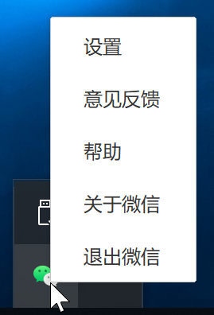
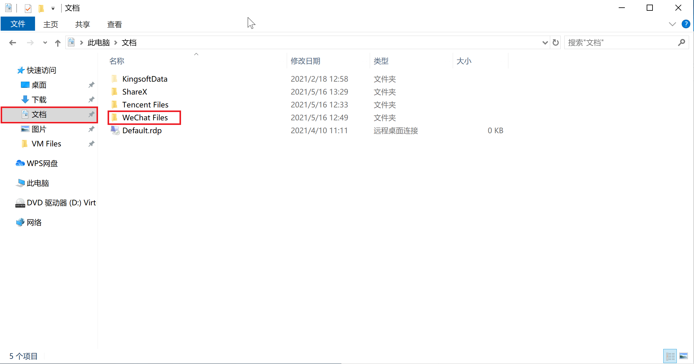
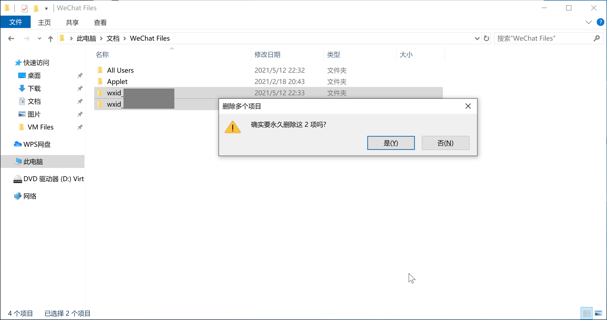
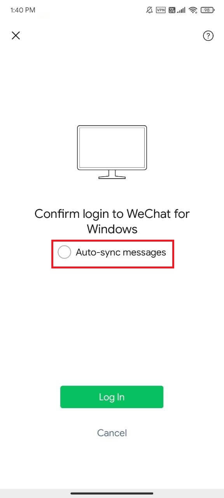

# 问题描述
微信 Windows 版出现能够登录，但无法接收新信息（尤其是通过文件传输助手传输的文件），且顶栏一直显示“收取中”的情况。此情况通常出现在电子白板上，目前暂未发现有教师、学生的个人电脑出现此问题。

# 产生原因
目前看来，出现此问题的原因是微信的消息数据库存在缺陷，在索引大量消息时出现了性能瓶颈，导致无法继续向数据库中写入新表（接收新消息）。

# 解决方案
对于电子白板出现的此问题，我们给出的解决方案是*删除电脑上存储的消息数据库，并重新同步*。

!!!danger
    尽管微信 Windows 版允许与移动设备同步消息，但据笔者的亲身经历，此方法依然**存在丢失消息的风险**。请务必在操作之前**手动备份重要消息**！

1. 从任务栏中退出微信；  

2. 打开“计算机”（Windows 10 上被称作“此电脑”），点按侧边栏的“文档”列表项，打开当前用户的文档目录。在这里你应该可以看到一个叫做 "WeChat Files" 的文件夹，打开它；  
  

3. 在此文件夹中，你应该能看到若干个以 "wxid_" 开头的文件夹，选中它们，按下 <kbd>Shift</kbd> + <kbd>Delete</kbd> 键永久删除它们；  

4. 重新登录微信，在移动设备端的登陆屏幕上**取消选中“同步消息”选项**，再次尝试查看新消息。  

# 后记
微信是一个非常糟糕的即时通讯软件，无论是其 PC（含 Mac） 端还是移动（Android 和 iOS）端都缺乏作为一个“小而美”的“国民级聊天软件”所必备的素质，尤其不适合用于学校这种多部门协作办公场景。

以下是一些放弃微信的理由：

- PC端仅支持扫码登录。
- 根据中国大陆法律[^1]，微信必须将**所有用户的所有消息存储在自己的服务器内**；但微信依然对外宣称”消息仅存储在本地“，**拒绝提供基于云端的历史消息同步服务**。
- 性能奇差无比（此文的出现就是一个很好的证明）。
- 最大文件传输大小仅为 25 MB，七天后过期。
- 微信群聊无法单独设置禁言、无法添加置顶公告。
- Android 端拒绝接入任何厂商的推送服务（如 Google 的 Firebase Cloud Messaging、华为的 HMS Push、小米的 MiPush 等），而是使用常驻后台建立长连接的方式推送消息，比起使用厂商推送服务推送而言更加耗电，且极其占用运行内存。微信在后台占用的内存容量甚至超过了笔者手机上安装的某 3D 游戏以高画质运行时的占用量。
- 使用自行开发的相册组件（而非系统相册组件）发送图片；此组件性能极差且不遵循 Android 规范，会将缓存文件夹内的缩略图一并显示；且会再次为每一张图片额外创建一份缓存，大量消耗手机存储空间。
- 语言消息不支持进度回溯，一旦漏听某个音节就必须再次从头听起。
- 自定义 Android TextView 画虎不成反类犬，不仅未能模仿出 iOS 上优秀的 UITextView 体验，反而破坏了 Android 上正在不断改进的 TextView 体验。具体表现包括但不限于：无法通过双击文本进入文本选择模式、长按文本只能选择一个字符（原生 TextView 支持自动选择一个单词）、不支持三击选择整段文字等。

我们强烈建议使用 [钉钉](https://www.dingtalk.com/){: target="_blank" rel="noopener noreferrer" .external }、[飞书](https://www.feishu.cn/){: target="_blank" rel="noopener noreferrer" .external }、[Slack](https://slack.com/intl/zh-cn/){: target="_blank" rel="noopener noreferrer" .external } 等专为办公设计的实时通讯软件替代微信。

[^1]: 
    《中华人民共和国反恐怖主义法》第十八条：电信业务经营者、互联网服务提供者应当为公安机关、国家安全机关依法进行防范、调查恐怖活动提供技术接口和解密等技术支持和协助。  
    《互联网信息内容管理行政执法程序规定》第十八条：互联网信息内容管理部门进行案件调查取证时，执法人员不得少于两人，并应当出示执法证。必要时，也可以聘请专业人员进行协助。首次向案件当事人收集、调取证据的，应当告知其有申请办案人员回避的权利。向有关单位、个人收集、调取证据时，应当告知其有如实提供证据的义务。被调查对象或者有关人员应当如实回答询问并协助、配合调查，及时提供依法应当保存的互联网信息服务提供者发布的信息、用户发布的信息、日志信息等相关材料，不得阻挠、干扰案件的调查。  
    《网络产品和服务安全审查办法》第十二条：网络产品和服务提供者应当对网络安全审查工作予以配合，并对提供材料的真实性负责。  
    《中华人民共和国网络安全法》第十七条　国家实行网络安全等级保护制度。网络运营者应当按照网络安全等级保护制度的要求，履行下列安全保护义务，保障网络免受干扰、破坏或者未经授权的访问，防止网络数据泄露或者被窃取、篡改：  
    （一）制定内部安全管理制度和操作规程，确定网络安全负责人，落实网络安全保护责任；  
    （二）采取防范计算机病毒和网络攻击、网络入侵等危害网络安全行为的技术措施；  
    （三）采取记录、跟踪网络运行状态，监测、记录网络安全事件的技术措施，并按照规定留存网络日志；  
    （四）采取数据分类、重要数据备份和加密等措施；  
    （五）法律、行政法规规定的其他义务。  